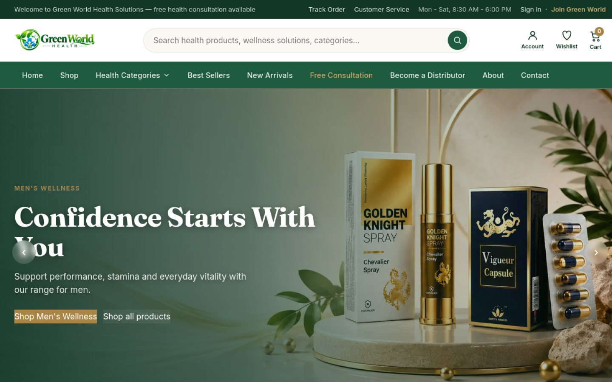
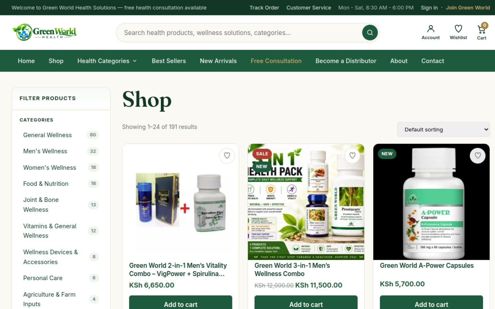
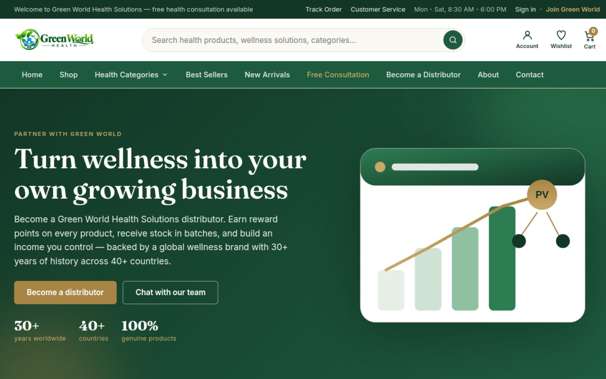
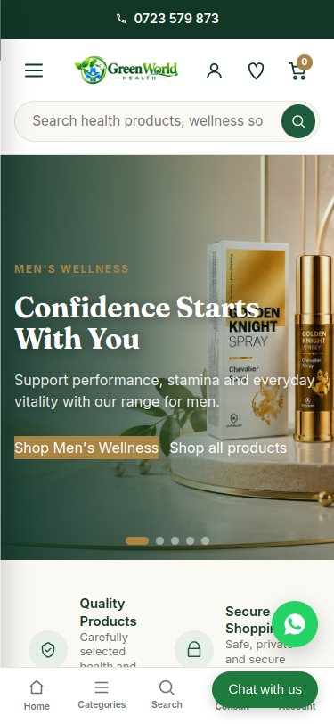
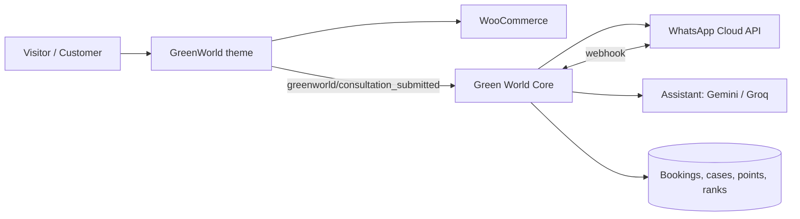

<div align="center">


# Green World Health Solutions Kenya

### Premium WordPress + WooCommerce platform for [greenworldhealth.co.ke](https://greenworldhealth.co.ke/)

A health and wellness store, distributor programme and customer-care platform for Green World products in Kenya, built on one theme and one companion plugin.


[Live site](https://greenworldhealth.co.ke/) · [Shop](https://greenworldhealth.co.ke/shop/) · [Become a Distributor](https://greenworldhealth.co.ke/become-a-distributor/) · [Theme docs](greenworld/README.md) · [Plugin docs](greenworld-core/README.md) · [Changelog](greenworld/CHANGELOG.md)

</div>

---



## Overview

Green World Health Solutions is a Nairobi-based retailer and distributor network for Green World wellness products. This repository contains the full custom platform behind the live store:

| Package | Folder | Version | Role |
| --- | --- | --- | --- |
| **GreenWorld Wellness** (parent theme) | [`greenworld/`](greenworld) | 1.34.5 | Storefront, design system, homepage, health funnels, SEO, performance and security |
| **GreenWorld Wellness Child** | [`greenworld-child/`](greenworld-child) | 1.30.1 | Update-safe layer for site-specific customisations |
| **Green World Core** (plugin) | [`greenworld-core/`](greenworld-core) | 0.16.1 | Business logic that must survive a theme change: WhatsApp, bookings, dashboards, distributor points, compliance and the AI assistant |

> The theme controls how the site looks. The plugin holds the business data, such as bookings, cases, distributors and points, so that data stays safe when the theme is updated or replaced.

## Screenshots

| Shop with category filters | Distributor programme |
| --- | --- |
|  |  |

<p align="center">
  <br>
  <sub>Mobile-first homepage with sticky bottom navigation and WhatsApp chat</sub>
</p>

## Health categories

<table>
  <tr>
    <td align="center"><br><sub>Men's Wellness</sub></td>
    <td align="center"><br><sub>Women's Wellness</sub></td>
    <td align="center"><br><sub>Immunity & Energy</sub></td>
    <td align="center"><br><sub>Joint & Bone</sub></td>
    <td align="center"><br><sub>Digestive Care</sub></td>
  </tr>
  <tr>
    <td align="center"><br><sub>Heart & Circulation</sub></td>
    <td align="center"><br><sub>Weight Management</sub></td>
    <td align="center"><br><sub>Detox & Wellness</sub></td>
    <td align="center"><br><sub>Food & Nutrition</sub></td>
    <td align="center"><br><sub>General Wellness</sub></td>
  </tr>
</table>

## Key features

### Storefront (theme)
- **Botanical green and ivory design system** with Fraunces and Inter typography, and colours you can change in the Customizer
- **Health mega-menu**, AJAX product search, cart drawer, wishlist, quick view and a sticky add-to-cart bar
- **Order on WhatsApp** button on every product, next to *Add to cart*
- **Shop filters** by category and price range, with product counts
- **Health landing pages** for men, women, weight, liver, kidney and general wellness
- **Free Health Consultation** intake (`[gw_health_consultation]`), with a consent checkbox. Submissions are stored privately and emailed to the store owner
- **Customer and Distributor registration**, with an optional sponsor or referral ID
- **Trust Center** and policy pages: privacy, terms, returns, shipping and the health disclaimer
- **Health guides** content type with topic maps, related content and automatic internal links
- **Product tabs** for ingredients and how-to-use, plus brand, GTIN and MPN fields for Google Merchant Center

### Business platform (Green World Core plugin)
| Module | What it does |
| --- | --- |
| **WhatsApp Cloud API** | Sends instant staff alerts for bookings, consultations, refills and distributor events |
| **Body scan bookings** | `[gw_scan_form]` booking form. Each booking is saved in wp-admin and sent to staff on WhatsApp |
| **My Green World dashboard** | Customer home with orders, wishlist, reward points, health support and one-click **Reorder** |
| **My Health** | Refill or change requests, progress check-ins and two-way messages with the care team |
| **Distributor programme** | Applications, admin activation, `GW#####` referral codes and a distributor dashboard |
| **Points ledger** | Point values per product, batch allocation and a balance that can never drift |
| **Rank engine** | Editable rank ladder based on lifetime points, direct referrals and team volume, with WhatsApp and email congratulations |
| **Consultation cases** | Case numbers, a status pipeline, advisor assignment, notes and an audit history |
| **Follow-up automation** | Acknowledgement and follow-ups at 2 and 7 days on WhatsApp and email. Messages are wellness-only |
| **Customer 360** | One admin screen showing a customer's profile, orders, points, distributor status and cases |
| **Abandoned cart recovery** | Three-step email reminders, one-click cart restore and unsubscribe. Off by default |
| **Product Compliance Engine** | Structured product records, a scanner for prohibited medical claims, and a front-end claims guard |
| **Green World Assistant (AI)** | A chat assistant on the website and WhatsApp. Answers use only approved product data and go through a GREEN / YELLOW / RED safety check first, and it can open cases for staff. It works with Gemini or Groq, and API keys stay on the server |

### Performance, SEO, accessibility and security
- **Performance:** one compiled CSS file, deferred vanilla JavaScript with no framework, lazy-loaded images with set dimensions, WebP images, a preloaded hero image and a built-in optimizer
- **SEO:** JSON-LD for Organization, WebSite and SearchAction, Store, Product and Breadcrumb, plus Open Graph and Twitter meta and robots rules. It steps aside when Yoast, Rank Math or AIOSEO is active
- **Accessibility:** WCAG 2.1 AA target, keyboard-friendly menus and drawers, visible focus states, ARIA labels and reduced-motion support
- **Security:** escaped output, sanitised input, nonce-protected AJAX, OWASP-style security headers and signed WhatsApp webhooks

## Architecture



## Project structure

```text
.
├── README.md
├── docs/screenshots/            # README images taken from the live site
├── greenworld/                  # Parent theme (PSR-4, namespaced GreenWorld\*)
│   ├── inc/
│   │   ├── Core/                # Theme container, Bootable contract, Assets
│   │   ├── Setup/               # Supports, menus, setup wizard, plugin installer, demo importer
│   │   ├── Account/             # Customer / Distributor registration
│   │   ├── Front/               # Home, Consultation, Trust, Trust Center
│   │   ├── Woo/                 # WooCommerce UI, filters, quick view, product identifiers
│   │   ├── Content/             # Guides, topic map, internal links, relations, seeder
│   │   ├── Seo/                 # Schema, meta, meta box, breadcrumbs, robots
│   │   ├── Performance/  Security/  Search/  Customizer/  Admin/  Compat/  Support/
│   │   └── funnel/              # Health landing-page renderer
│   ├── assets/{css,js,img}/     # Design system, app.js, category and hero photos
│   ├── page-*.php               # About, FAQ, distributor, funnels, policies, Trust Center
│   ├── starter/  demo/          # Starter pages and demo catalogue
│   ├── theme.json  style.css  functions.php
│   ├── README.md  CHANGELOG.md
├── greenworld-child/            # Child theme (active)
└── greenworld-core/             # Companion plugin
    ├── greenworld-core.php
    ├── includes/class-gwc-*.php # One module per feature (see table above)
    └── README.md
```

## Requirements

| Component | Version |
| --- | --- |
| WordPress | 6.4 or later (tested up to 6.7) |
| WooCommerce | 8.0 or later (tested up to 9.5) |
| PHP | 8.0 or later. The theme requires 8.0; the plugin runs on 7.4 or later |
| Optional | M-Pesa WooCommerce gateway, Meta WhatsApp Cloud API app, and a Gemini or Groq API key for the assistant |

## Installation

1. **Theme:** zip `greenworld/` and upload it under **Appearance > Themes > Add New > Upload Theme**.
2. **Child theme:** zip and upload `greenworld-child/`, then **activate the child theme**.
3. **Plugin:** upload `greenworld-core/` to `wp-content/plugins/` and activate **Green World Core**.
4. Follow the **Appearance > GreenWorld Setup** wizard to install plugins, create pages, set the static homepage, add menus and apply WooCommerce defaults for Kenya (KES).
5. Re-save **Settings > Permalinks** once so the *My Health* and *Distributor* account tabs register.
6. Optional: configure WhatsApp, cart recovery and the AI assistant under **Settings > Green World** and **WooCommerce > Cart Recovery**.

> **Deployment note:** commits to this repo do **not** deploy automatically. Upload the changed theme or plugin folders to hosting for updates to go live.

Full guides: [Theme README](greenworld/README.md) · [Plugin README](greenworld-core/README.md)

## Configuration without code

Under **Appearance > Customize > GreenWorld Wellness** you can change:
- **Header and contact details:** phone, WhatsApp, email, hours, address, top-bar message and the WhatsApp order message
- **Branding and colours:** botanical green, deep green and brass accent
- **Homepage:** hero slides, categories and section order
- **Health disclaimer:** shown site-wide and on product pages

## Responsible health communication

The platform is designed to make **no medical claims**:
- Consultations are framed as general wellness guidance, not a diagnosis or emergency service.
- The Compliance Engine flags and can hide high-risk claim phrases such as "cures" or "anti-cancer".
- The AI assistant answers only from approved product data, and a safety check sends sensitive questions to a human advisor.

## Extending

Add all customisations to `greenworld-child/`. Useful filters:

```php
add_filter( 'greenworld_social_profiles', fn() => [ 'https://facebook.com/...', 'https://instagram.com/...' ] );
add_filter( 'greenworld_disable_schema', '__return_true' ); // hand schema to your SEO plugin
```

Plugin hooks: `greenworld/consultation_submitted` (theme to plugin) and `greenworld/scan_booked`.

## Business

**Green World Health Solutions**
Development House, 11th Floor, Room 7, Nairobi, Kenya
Phone and WhatsApp: [0723 579 873](tel:0723579873) · Email: [info@greenworldhealth.co.ke](mailto:info@greenworldhealth.co.ke)
Hours: Mon - Sat, 8:30 AM - 6:00 PM

## Credits

Designed, developed and maintained by **[Pimofy Digital](https://github.com/moselanto)**, Nairobi.
Fonts: Fraunces and Inter (Google Fonts, SIL Open Font License).

## License

GNU General Public License v2 or later. See the [license text](http://www.gnu.org/licenses/gpl-2.0.html).

<sub>Products on this site are food and wellness supplements. They are not intended to diagnose, treat, cure or prevent any disease.</sub>
